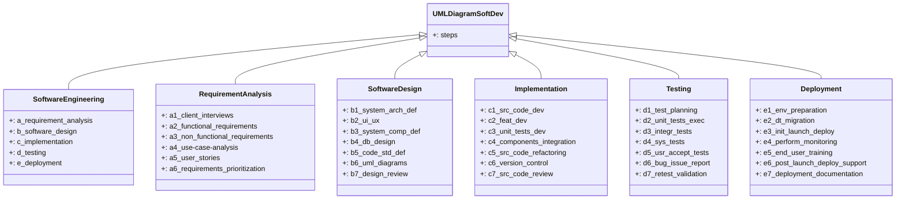

```mermaid
classDiagram

    class UMLDiagramSoftDev {
        +: steps
    }

    class SoftwareEngineering {
        +: a_requirement_analysis
        +: b_software_design
        +: c_implementation
        +: d_testing
        +: e_deployment
    }

    class RequirementAnalysis {
        +: a1_client_interviews
        +: a2_functional_requirements
        +: a3_non_functional_requirements
        +: a4_use-case-analysis
        +: a5_user_stories
        +: a6_requirements_prioritization
    }

    class SoftwareDesign {
        +: b1_system_arch_def
        +: b2_ui_ux
        +: b3_system_comp_def
        +: b4_db_design
        +: b5_code_std_def
        +: b6_uml_diagrams
        +: b7_design_review
    }

    class Implementation {
        +: c1_src_code_dev
        +: c2_feat_dev
        +: c3_unit_tests_dev
        +: c4_components_integration
        +: c5_src_code_refactoring
        +: c6_version_control
        +: c7_src_code_review
    }

    class Testing {
        +: d1_test_planning
        +: d2_unit_tests_exec
        +: d3_integr_tests
        +: d4_sys_tests
        +: d5_usr_accept_tests
        +: d6_bug_issue_report
        +: d7_retest_validation
    }

    class Deployment {
        +: e1_env_preparation
        +: e2_dt_migration
        +: e3_init_launch_deploy
        +: e4_perform_monitoring
        +: e5_end_user_training
        +: e6_post_launch_deploy_support
        +: e7_deployment_documentation
    }

    UMLDiagramSoftDev <|-- SoftwareEngineering
    UMLDiagramSoftDev <|-- RequirementAnalysis
    UMLDiagramSoftDev <|-- SoftwareDesign
    UMLDiagramSoftDev <|-- Implementation
    UMLDiagramSoftDev <|-- Testing
    UMLDiagramSoftDev <|-- Deployment
```